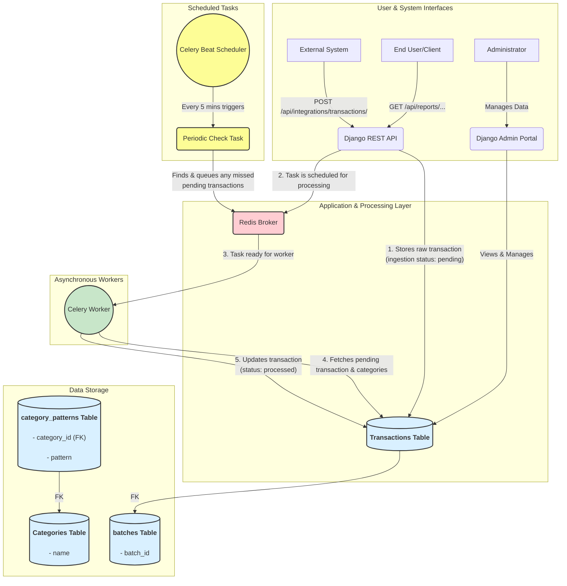

# Solution Design: BI Dashboard

## 1. Introduction

This document outlines the high-level solution design for a Django-based application designed to ingest, process, and report on financial transactions. The system is built to be scalable and extensible, with a core focus on asynchronous processing and a pluggable architecture for transaction enrichment.

The primary goals of this architecture are to ensure that incoming data is captured quickly and reliably, while the more intensive processing work is offloaded to a background process to maintain API responsiveness.

## 2. High-Level Architecture Diagram

The following diagram illustrates the major components of the system and their interactions:

## 3. Core Components

*   **Django Application:** 
    *   **Django REST Framework:** For building the API endpoints.
    *   **Django Admin Portal:** An interface for administrators to manage categories, view transaction data, and oversee the system.
*   **PostgreSQL Database:** The primary relational database.
*   **Celery:** A distributed task queue used for executing background work asynchronously.
*   **Redis:** An in-memory data store acting as the message broker for Celery.
*   **Celery Beat:** A scheduler that triggers periodic tasks.

## 4. Data Ingestion & Enrichment Flow

1.  **Ingestion:** An external system sends a `POST` request with batch transaction data to the `/api/integrations/transactions/` endpoint.
2.  **Batch Creation:** The Django API validates the incoming data and creates a `Batch` record with status `pending` to track the ingestion request.
3.  **Initial Storage:** Transaction records are created in the `transactions` table in PostgreSQL with an `ingestion_status` of `pending`, linked to the batch. This ensures data is captured quickly and the API can return a `202 Accepted` response with the `batch_id`.
4.  **Asynchronous Task Trigger:** Immediately after saving, the application enqueues a batch processing task in Redis for the Celery worker.
5.  **Batch Processing (Async):** A Celery worker, picks up the batch processing task from the Redis queue and updates the batch status to `processing`.
6.  **Rule-Based Categorization:** The enrichment process involves matching the transaction's merchant name or description against the patterns defined in the `category_patterns` table. This is achieved using **case-insensitive bidirectional substring matching** (pattern in text OR text in pattern).
7.  **Pluggable Design:** This categorization logic is intentionally modular through the `TransactionCategorizer` interface. The current rule-based `DatabaseCategorizer` can be replaced in the future with a more advanced method, like an AI/LLM service, without requiring a major architectural overhaul.
8.  **Data Update:** Once categorization is complete, the Celery worker performs a bulk update on all transactions in the batch, setting their `category` field and updating `ingestion_status` to `completed`. The batch status is also updated to `completed`. If errors occur, statuses are set to `failed`.

### Status Values

The system uses four status values for tracking both batch and transaction processing:
- **pending**: Initial state when data is first ingested
- **processing**: Actively being processed by a Celery worker
- **completed**: Successfully processed and enriched
- **failed**: Processing encountered an error

## 6. Reporting API

The `/api/reports/account/{account_id}/summary` endpoint provides a summarized view of an account's transactions.

*   It's a `GET` endpoint that requires an `account_id`.
*   It accepts `start_date` and `end_date` query parameters to filter the transactions within a specific timeframe (YYYY-MM-DD format, maximum 365-day range).
*   The view queries the PostgreSQL database, aggregating transaction data to generate metrics including:
    *   Total transactions count
    *   Total spend (sum of negative amounts)
    *   Total income (sum of positive amounts)
    *   Net amount (income + spend)
    *   Top 3 spending categories with transaction counts
    *   Processing status breakdown (pending, processing, completed, failed)
*   Results are serialized and returned as JSON.

## 7. Caching Strategy

The system implements a multi-layer caching strategy using Redis to improve performance:

### 7.1 Report Caching
*   **Account Summary Reports:** Results from the `/api/reports/account/{account_id}/summary` endpoint are cached for 5 minutes (300 seconds).
*   **Cache Key Structure:** `account_summary:{account_id}:{start_date}:{end_date}`
*   **Invalidation:** Cache entries automatically expire after 5 minutes, ensuring reports remain reasonably fresh while reducing database load.

### 7.2 Categorization Pattern Caching
*   **Category Patterns:** The `DatabaseCategorizer` caches all category patterns for 60 seconds to avoid repeated database queries during batch processing.
*   **Cache Key:** `transaction_category_patterns`
*   **Invalidation:** The cache is automatically invalidated when categories or patterns are created, updated, or deleted through the Django admin interface.
*   **Benefits:** Improves throughput during high-volume batch processing by eliminating repeated pattern lookups.

## 8. Scalability considerations
* **Improved data ingestion** Potentially using Kafka and small ingestion API in Go
* **Observability** NewRelic and Sentry integrations for monitoring, alerts and APM
* **AI Integration point** Categorization logic is pluggable and can easily be altered with a different AI system
* **Production deployment** This highly depends on the scale, team size and team capabilities. Where does this have to be run? AWS -> ECS. AWS EC2 and RDS simple initial rollout.